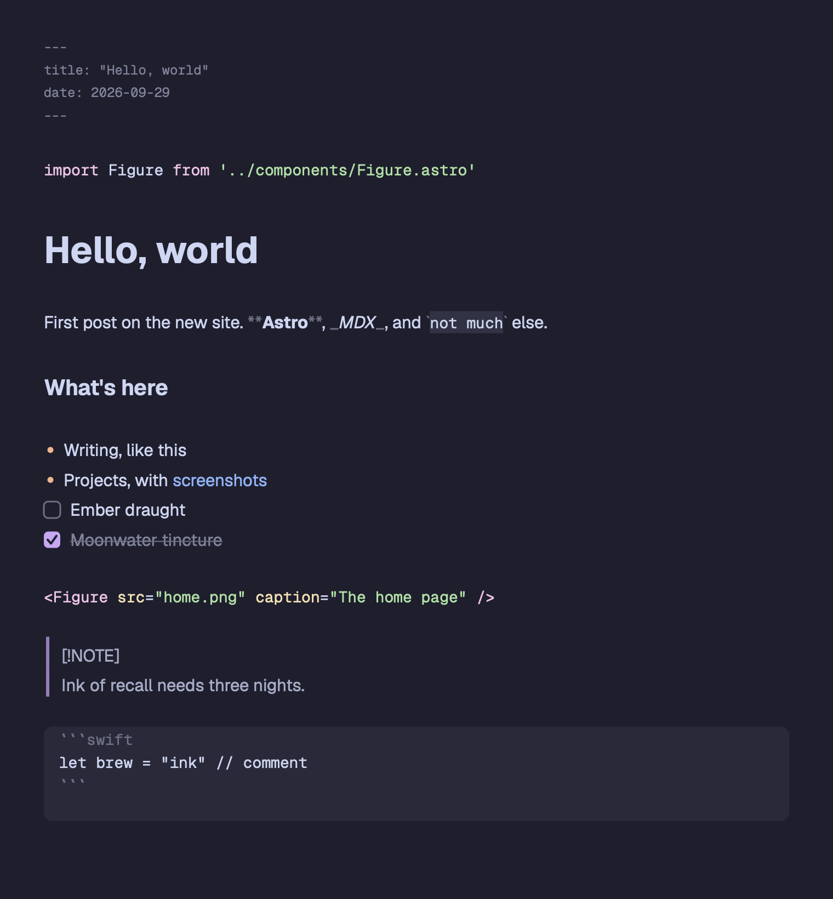
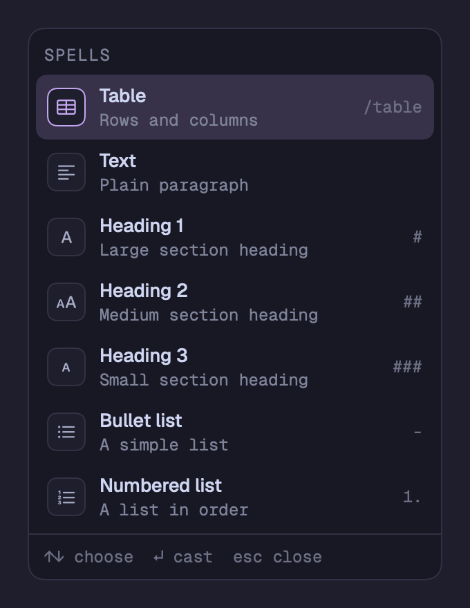
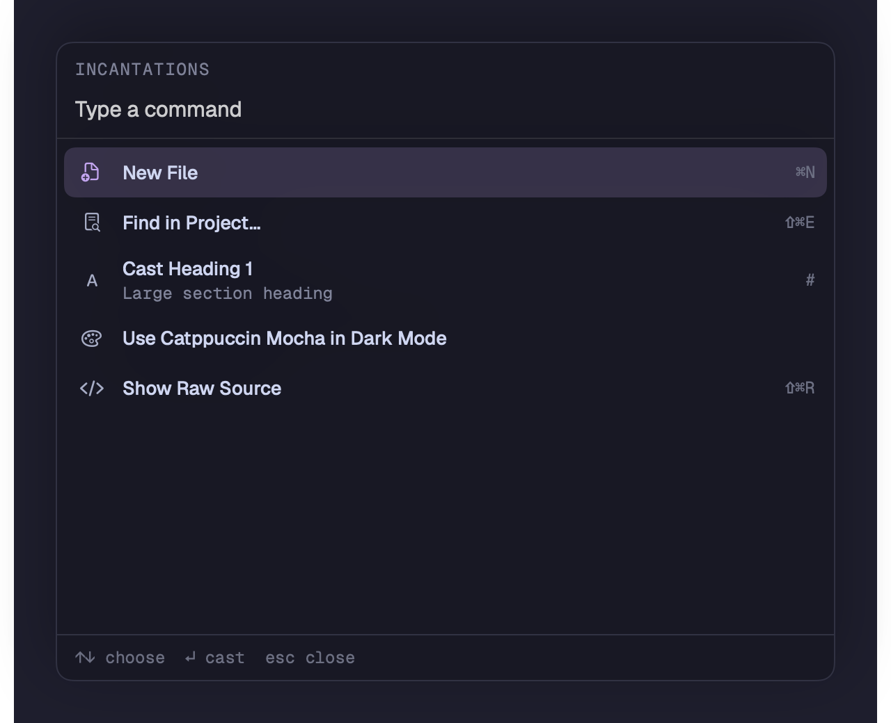

<p align="center">
  <picture>
    <source media="(prefers-color-scheme: dark)" srcset="Brand/wordmark-dark.svg">
    
  </picture>
</p>

<p align="center">
  A native markdown editor for macOS. Plain files on disk, written like a spellbook.
</p>

<p align="center">
  <a href="https://github.com/xchrisbailey/grimoire.srcery/releases">Download</a> ·
  <a href="#build-from-source">Build from source</a> ·
  <a href="https://github.com/xchrisbailey/grimoire.srcery/issues">Issues</a>
</p>

---

Grimoire is a Mac app for writing in markdown. You edit in blocks, the way you would in Notion, but every page is an ordinary `.md` or `.mdx` file in a folder you own. There's no database, no account and no sync service: bind a folder and start writing.

> [!NOTE]
> Grimoire is in **beta** (v1.0.0-beta). It's ready to write in, but expect rough edges, and keep your folders under git or another backup while it settles.

<p align="center">
  
</p>

## Features

**Cast blocks as you write.** Type `/` to open the Spells menu and turn a line into a heading, list, task, quote, callout, code block, table, divider, image, link, date or frontmatter. Markdown shortcuts like `#`, `-` and `1.` work as you type too.

**Incantations.** Press <kbd>⌘K</kbd> to summon every command in the app by name, from casting a heading to switching themes.

<p align="center">
  
  &nbsp;
  
</p>

**Preview or Raw.** Pages open in Preview, a live-styled view you edit directly. Press <kbd>⇧⌘R</kbd> to see the raw source, with syntax coloring and Spells still at hand.

**Tables that behave.** Edit markdown tables as a grid. Tab and Return move between cells, the context menu adds and removes rows and columns, and pasted spreadsheet cells become a table, all without lining up pipes by hand.

**Code blocks in colour.** Fenced code is highlighted with tree-sitter grammars for Swift, JavaScript, TypeScript, Python, Go, Rust, C, C++, Ruby, SQL, Bash, HTML, CSS, JSON, YAML, TOML and markdown.

**Projects and folders.** A project binds one or more folders from anywhere on disk, each with an optional alias in the sidebar. Open any page with <kbd>⌘P</kbd>, search every page with <kbd>⇧⌘E</kbd> and jump between headings with <kbd>⇧⌘J</kbd>.

**Themes.** Catppuccin, Dracula, GitHub, Gruvbox, Nord, One Dark, Rosé Pine, Solarized and Tokyo Night, with separate picks for light and dark mode. Borrow the look of any VS Code theme, and choose your own fonts and sizes.

**Focus.** Hide everything but the page with <kbd>⇧⌘F</kbd>, dim all but the current sentence, cap the line length, or highlight parts of speech to see how your sentences are built.

**Version history.** Grimoire keeps earlier versions of each page, so you can browse what changed and restore one. In a git repository it also shows changes since the last commit.

**Export.** Export to HTML or PDF, print, or copy a page as rich text to paste into mail or a doc.

**On-device intelligence.** With Apple Intelligence turned on, Grimoire can continue, rewrite, shorten, expand, summarize, outline or translate your writing (<kbd>⌥⌘J</kbd>), explain a code block, suggest frontmatter, write alt text for images and read the text out of them, and answer questions about your whole project from its pages (<kbd>⇧⌘A</kbd>). It runs on Apple's on-device model. Longer requests use Private Cloud Compute only if you allow it in Settings.

Every shortcut can be changed in **Settings > Shortcuts**.

## Install

Grimoire needs **macOS 27** or later. Intelligence features also need a Mac with Apple Intelligence turned on.

1. Download the latest `Grimoire-<version>.dmg` from [Releases](https://github.com/xchrisbailey/grimoire.srcery/releases).
2. Open the DMG and drag **Grimoire** into **Applications**.
3. The beta isn't notarized by Apple yet, so macOS blocks the first launch. In Applications, right-click **Grimoire**, choose **Open**, then choose **Open** again. You only need to do this once.

   If macOS still won't open it, remove the quarantine flag in Terminal:

   ```sh
   xattr -dr com.apple.quarantine /Applications/Grimoire.app
   ```

Signed and notarized builds are planned before 1.0 ([#16](https://github.com/xchrisbailey/grimoire.srcery/issues/16)). Grimoire doesn't update itself yet, so check Releases for new betas.

An iOS app is planned ([#17](https://github.com/xchrisbailey/grimoire.srcery/issues/17)).

## Build from source

You need:

- A Mac running macOS 27
- Xcode 27 (with the macOS 27 and iOS 27 SDKs)
- [XcodeGen](https://github.com/yonaskolb/XcodeGen), for example `brew install xcodegen`

The Xcode project is generated from `project.yml` and isn't checked in. Generate it and open it:

```sh
git clone https://github.com/xchrisbailey/grimoire.srcery.git
cd grimoire.srcery
xcodegen generate
open Grimoire.xcodeproj
```

Choose the **GrimoireMac** scheme and press <kbd>⌘R</kbd> to build and run.

The first build downloads the tree-sitter grammars used to color code blocks, so it needs a network connection and takes a few minutes.

App sources are synced folders, so new files build without regenerating. Run `xcodegen generate` again only when `project.yml` changes.

To build from the command line instead:

```sh
xcodebuild build -project Grimoire.xcodeproj -scheme GrimoireMac -destination 'platform=macOS'
```

## Test

Each Swift package has its own tests:

```sh
(cd Packages/GrimoireCore && swift test)
(cd Packages/GrimoireEditor && swift test)
(cd Packages/GrimoireIntelligence && swift test)
```

Formatting uses `swift-format` (ships with Xcode) and SwiftLint. CI runs both in strict mode:

```sh
xcrun swift-format format --in-place --recursive Apps Packages
swiftlint
```

CI runs the package tests, builds the Mac and iOS apps, and lints on every pull request.

## Project layout

| Path | What lives there |
|---|---|
| `Packages/GrimoireCore` | Pure Swift: document and block model, markdown parsing and serializing, workspaces, themes, search, version history. No AppKit or UIKit. |
| `Packages/GrimoireEditor` | TextKit 2 editor engine with thin `NSTextView` / `UITextView` adapters, Spells, export and font helpers. |
| `Packages/GrimoireIntelligence` | Writing commands, image reading and project answers on Apple's Foundation Models. |
| `Apps/GrimoireMac` | SwiftUI macOS app. |
| `Apps/GrimoireiOS` | Placeholder iOS app so the shared code keeps compiling for iOS. |
| `Apps/Shared` | Asset catalog shared by both apps. |
| `Resources` | String Catalog and bundled fonts, shared by both apps. |
| `Brand` | The mark, wordmark and app icon. See [Brand/README.md](Brand/README.md). |
| `scripts` | `package-mac.sh`, which builds the release DMG. |

Packaging a DMG, signing and notarization, and tagged releases from CI are covered in [docs/RELEASING.md](docs/RELEASING.md).

## Contributing

Work is tracked in [GitHub Issues](https://github.com/xchrisbailey/grimoire.srcery/issues), starting from the v1 epic [#1](https://github.com/xchrisbailey/grimoire.srcery/issues/1). Bug reports and ideas are welcome there.
